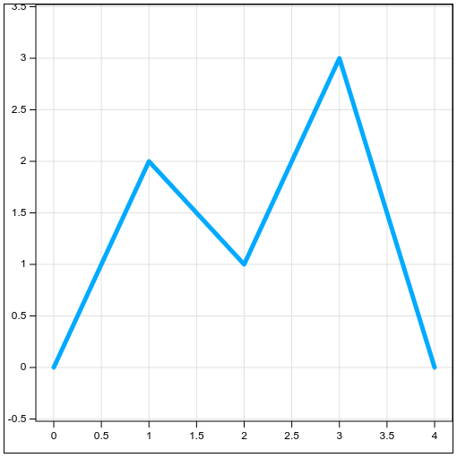

# Line chart


## Installation

You can install the library using npm:

```bash
npm install ij222pv/line-chart
```

## Example usage

```javascript
import { LineChart, Point, Polyline, Color } from "line-chart";

const points = [
  new Point(0, 0),
  new Point(1, 2),
  new Point(2, 1),
  new Point(3, 3),
  new Point(4, 0),
];

const lineChart = new LineChart();
lineChart.addLine(
  new Polyline(points, {
    color: new Color("hsl(200, 100%, 50%)"),
    thickness: 5,
  })
);
lineChart.autoFitViewport({
  paddingY: 60,
  paddingX: 20,
});
document.body.appendChild(lineChart);
```



## Public API
### **LineChart**
**addLine(line: Polyline): void**

Adds a line to the chart.

**clearLines(): void**

Removes all lines from the chart.

**setViewport(viewport: Rectangle)**

Sets the viewport of the chart to the specified rectangle, in chart coordinates.

**autoFitViewport(options: Object): void**

Automatically adjusts the viewport to fit all lines.

The `options` object may contain:

`paddingX: number` - The padding in pixels on the x-axis between chart lines and chart edge.

`paddingY: number` - The padding in pixels on the y-axis between chart lines and chart edge.

**axisTickInterval**

The target interval in pixels between axis ticks. The actual interval will differ from this value to ensure that ticks are at "nice" values.

**width**

The width of the chart canvas in pixels. Defaults to 500.

**height**

The height of the chart canvas in pixels. Defaults to 500.

### **Polyline**
**constructor(points: Point[], options?: Object)**

The `options` object may contain:

`color: Color` - The color of the line. The default is black.

`thickness: number` - The thickness of the line in pixels. The default is 1.

**points** {readonly}

An array of Point objects representing the vertices of the polyline.

**color** {readonly}

The color of the line.

**thickness** {readonly}

The thickness of the line in pixels.

### **Point**
**constructor(x: number, y: number)**

Creates a point with the specified x and y coordinates.

**x** {readonly}

The x coordinate of the point.

**y** {readonly}

The y coordinate of the point.

### **Color**
**constructor(cssColor: String)**

`cssColor` is a CSS color string such as "red" or "hsl(200, 100%, 50%)". The default is "black";

More examples are available at https://developer.mozilla.org/en-US/docs/Web/CSS/color_value

**toString(): String**

Get the color as a CSS-compatible string.

### **Rectangle**
**constructor(topLeftPoint: Point, bottomRightPoint: Point)**

**topLeft: Point** {readonly}

**topRight: Point** {readonly}

**bottomRight: Point** {readonly}

**bottomLeft: Point** {readonly}

**top: number** {readonly}

**right: number** {readonly}

**bottom: number** {readonly}

**left: number** {readonly}

**width: number** {readonly}

**height: number** {readonly}

## Contributing

Anybody can contribute to this project by opening issues or pull requests.

## License

This project is licensed under the MIT License. See the [LICENSE](LICENSE) file for details.