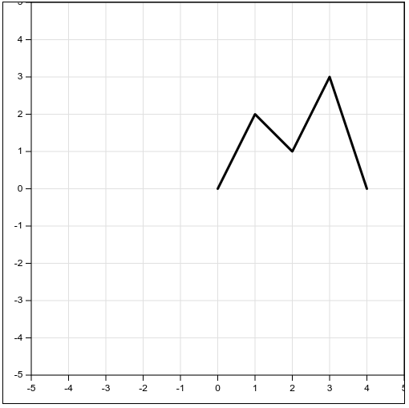

# Test report

## Summary of testing

Testing of the module is done manually by visiting the test app and visually inspecting the rendered charts. The git repository for the test app is available at https://github.com/ij222pv/line-chart-test

All the test cases and their expected results are documented below.

## Tests

### TC1 - Simple line chart

**Expected result**:

The result should look like in the screenshot. The entire chart line should be fitted within the chart area.

### TC2 - Auto-fitted line chart with padding

**Expected result**:

In addition to TC1, there should be a padding of 75 pixels between the chart line and the edges of the chart area.

### TC3 - Custom line color and thickness

**Expected result**:

The line should have a red color and a thickness of 10 pixels.

### TC4 - Multiple lines with different colors and thicknesses

**Expected result**:

There should be two lines in the chart, one red with a thickness of 10 pixels, and one blue with a thickness of 3 pixels.

### TC5 - Auto-fitted line chart with nice axis tick intervals

**Steps**:

1. Move the slider above the chart to the very left and slowly move it all the way to the right.
2. Observe that the chart's size increases in both axes.
3. Confirm that the interval between ticks on both axes are always a "nice" interval as described earlier.

**Expected result**:

Note how the interval between ticks on the x-axis is 2, and the interval between ticks on the y-axis is 0.5, both of which are "nice" intervals.

### TC6 - Custom axis tick interval

**Expected result**:

Ticks along the x and y axes should have a target interval of 200 pixels. It should look like the spacing between axis ticks is 4 times bigger than the spacing between axis ticks of the previous charts. It may not be exactly 200 pixels and 4 times the spacing of previous charts. 2-6 times the spacing is acceptable depending on rounding.

### TC7 - Custom viewport

**Description:** A chart with a custom viewport.

**Expected result:**

Chart viewport should cover a square with the bottom left corner at (-5, -5) and the top right corner at (5, 5).

## Test results

**Date:** 2025-10-01

**Version:** 2.0.0

| What is being tested?                                      | How is it being tested?                                         | Result |
| ---------------------------------------------------------- | --------------------------------------------------------------- | ------ |
| TC1 - Simple line chart                                    | Visually inspecting the rendered chart.                         | Pass   |
| TC2 - Auto-fitted line chart with padding                  | Visually inspecting the rendered chart.                         | Pass   |
| TC3 - Custom line color and thickness                      | Visually inspecting the rendered chart.                         | Pass   |
| TC4 - Multiple lines with different colors and thicknesses | Visually inspecting the rendered chart.                         | Pass   |
| TC5 - Auto-fitted line chart with nice axis tick intervals | Visually inspecting the rendered chart while moving the slider. | Pass   |
| TC6 - Custom axis tick interval                            | Visually inspecting the rendered chart.                         | Pass   |
| TC7 - Custom viewport                                      | Visually inspecting the rendered chart.                         | Pass   |
