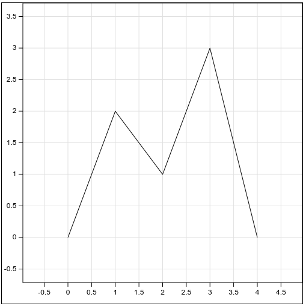
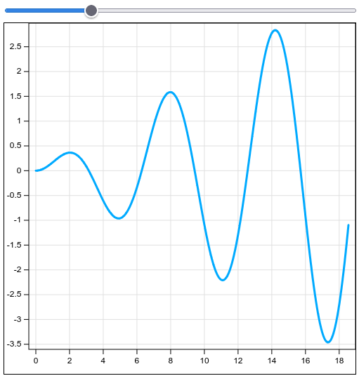

# Test report

## Summary of testing

Testing of the module is done manually by visiting the test app and visually inspecting the rendered charts. The git repository for the test app is available at https://github.com/ij222pv/line-chart-test

All the test cases and their expected results are documented below.

## Tests

### TC1

**Description:** Render a simple line chart with default options.

**Expected result**:

### TC2

**Description:** Render a line chart with padding between line and chart edge.

**Expected result**:

### TC3

**Description:** Render a line chart with custom colors and line thickness.

**Expected result**:

### TC4

**Description:** Render a line chart with multiple lines with different color and thickness.

**Expected result**:

### TC5

**Description:** Ticks along the x and y axes should always be placed at "nice" intervals. "nice" intervals are a number in the pattern 0.1, 0.2, 0.5, 1, 2, 5, 10, 20, 50, etc.

**Steps**:

1. Move the slider above the chart to the very left and slowly move it all the way to the right.
2. Observe that the chart's size increases in both axes.
3. Confirm that the interval between ticks on both axes are always a "nice" interval as described earlier.

**Expected result**:

Note how the interval between ticks on the x-axis is 2, and the interval between ticks on the y-axis is 0.5, both of which are "nice" intervals.

### TC6

**Description:** Ticks along the x and y axes should have a target interval of 200 pixels. It should look like the spacing between ticks is bigger (2-6 times bigger depending on rounding) than the spacing of the previous charts.

**Expected result**:

## Test results

**Date:** 2025-10-01

**Version:** 2.0.0

| What is being tested? | How is it being tested?                                         | Result |
| --------------------- | --------------------------------------------------------------- | ------ |
| TC1                   | Visually inspecting the rendered chart.                         | Pass   |
| TC2                   | Visually inspecting the rendered chart.                         | Pass   |
| TC3                   | Visually inspecting the rendered chart.                         | Pass   |
| TC4                   | Visually inspecting the rendered chart.                         | Pass   |
| TC5                   | Visually inspecting the rendered chart while moving the slider. | Pass   |
| TC6                   | Visually inspecting the rendered chart.                         | Pass   |
